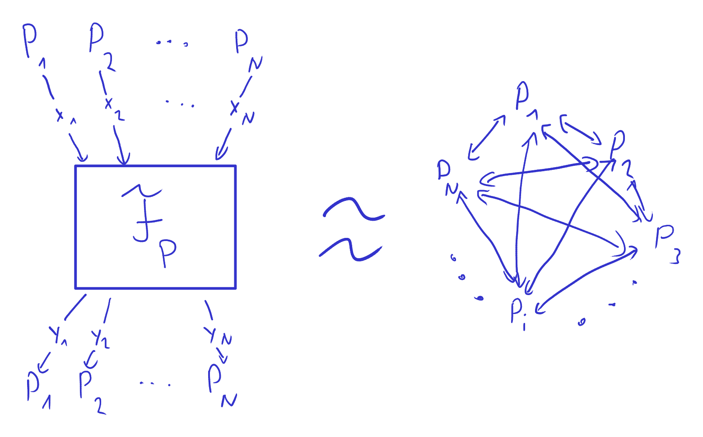

# The Real-Ideal World Simulation Paradigm

To argue the security of an MPC protocol \\(\mathcal{P}\\), we use the
following strategy:

To start, we imagine we are in an _ideal world_ where there is a
trusted third party that computes the protocol function for us. To do
the trusted party receives all inputs from all parties and executes
the **ideal functionality** \\(\mathcal{F}_\mathcal{P}\\), i.e. what
the protocol _is supposed to compute_, on the provided inputs to
obtain the party outputs. The trusted party then simply sends these
outputs to the corresponding parties.

In the _real world_ there is no trusted third party to do this for us,
but instead the parties run the protocol among themselves to obtain
their outputs.

We can now argue about the distributions of party inputs and outputs
to show security. A protocol is secure w.r.t. to a certain class of
adversary in the sense given before if for any such adversary in the
real world we can show that there must exist an adversary in the ideal
world such that distributions of of party inputs and outputs are
(roughly*) the same in the real and ideal cases.

Since, in the ideal world the only adversarial possibility is to
change the inputs of corrupted parties, showing such a statement
implies that also in the real world no more harm than that can be done
by an adversary (of that class). If that is the case then also the
requirements given before are all implied.

